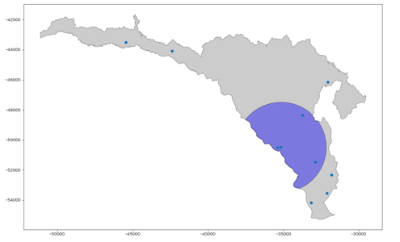
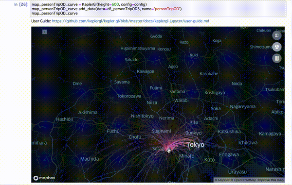

# Geo+Python
PyCon JP 2019 のポスターセッション`Geo+Python` で発表した内容をベースに、アップデートしています。

リンク：[Geo+Python](https://hackmd.io/@mamix1116/SkaGYlYLr)

## 内容

### 1. geopandasで空間分析と可視化

##### 使用したデータ
データは町田市のオープンデータ（© 町田市 クリエイティブ・コモンズ・ライセンス（表示4.0 国際））を改変して作成
- [町田市バリアフリーマップ](https://catalog.data.metro.tokyo.lg.jp/dataset/t132098d0000000016)

### 2. Kepler GL for Jupyter で可視化しよう

##### 使用したデータ
[パーソントリップＯＤ量データ（東京都市圏）](http://nlftp.mlit.go.jp/ksj/gml/datalist/KsjTmplt-S05-b-v2_2.html) を使用しています。
（各自データをダウンロードしてください。）

## インストール

`pip install -r requirements.txt`

##### (メモ) `rtree` がインストールできないエラー

`brew install spatialindex` してから、`pip install rtree` したらうまくいった。
